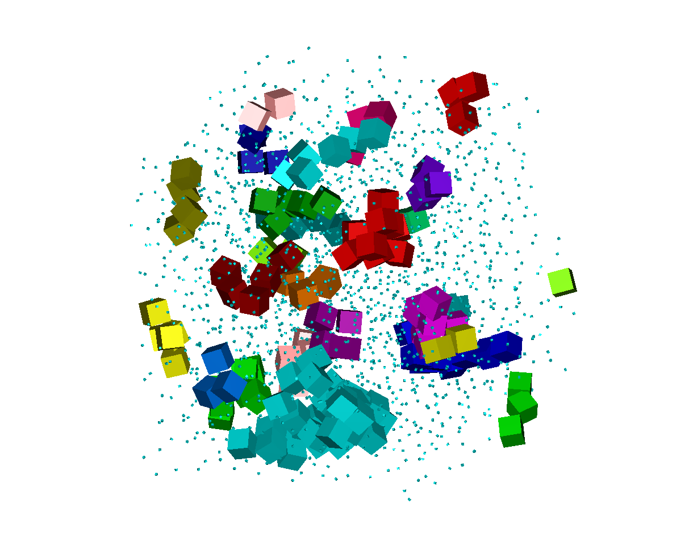

Usage of h_slc_cl_read.c
========================

Compile on Linux with `gcc -Wall -O3 h_slc_cl_read.c -lm -o v1read`. On Windows, `-lm` is not necessary.  
`-Wall` for all warnings, `-O3` for maximum optimization, `-lm` to link math library `math.h`.  
Note the program also needs the files `math_3d.h` and `mt19937.h` (also in this repository) in the same directory as `h_slc_cl_read.c`.

The output program `v1read` will take 6 arguments:  
  1. (r or read / c or create)
  2. (readfile / Number of cubes per dimension)
  3. mc_steps, the number of Monte Carlo sweeps (= steps per particle)
  4. packing_fraction, the desires starting packing fraction*
  5. BetaP, the (dimensionless) pressure
  6. Phi, the slant angle

*= if there is overlap the system will expand (and thus reduce packing fraction).

By the way, h_slc_cl_read stands for  
**h**ard **sl**anted **c**ubes, using **c**ell **l**ists, **read** parameters from the command line.

---
## Output

The program outputs some debug data at the start and then every 100 steps it outputs the volume, step acceptance ratios (of move, rotation, and volume moves), and then the corresponding maximum stepsize of each kind of step (i.e. max distance per trial move, max rotation in radians per trial move, max change in volume per trial move).

It also outputs the density of the system every 100 steps to e.g. `densities/v1_12pf0.50p01.0a1.27`.  
(meaning 12 cubes per dimension, starting packing fraction of 0.50, pressure of 1.0, slant angle of 1.27 radians (~72 degrees))

Lastly it also outputs snapshots of the system every 100 steps into e.g. `datafolder/v1_12pf0.50p01.0a1.27/coords_stepXXXXXXX.poly`, where XXXXXXX is the step number.

---
## Examples

Example 1: `./v1read c 12 500001 0.50 8.0 1.26610367`  
**c**reates a system of **12** cubes per dimension,  
runs for **500001** steps,  
start at a packing fraction of **0.50**,  
set pressure to **8.0**,  
set slant angle of cubes to **1.26610367** radians (~72 degrees).

Example 2: `./v1read r coords_step0500000.poly 500001 0.60 1.0 1.26610367`  
**r**eads file **coords_step0500000.poly**, runs for **500001** steps,
and saves it in datafolder/v1_XXpf**0.60**p**01.0**a**1.27**, 
where XX = the number of cubes per dimension read _minus one_, this is a... _feature_. This rather clunky way of reading and saving is only temporary and a better way will be implemented later.

---
## Formatting of .poly
The format for the coordinate files is as follows.
For a selection of N slanted cubes of angle PHI and edge length L in a box described
by the matrix B (that is to say, the box is a parallelepiped spanned by the three
vectors that are the columns of the matrix B), their positions given by the vector R
and their orientation described by the rotation matrix M, the format is:

N  
0 0 0  
B_00 B_01 B_02  
B_10 B_11 B_12  
B_20 B_21 B_22  
R_0 R_1 R_2 L M_00 M_01 M_02 M_10 M_11 M_12 M_20 M_21 M_22 10 PHI COLOR  
 
Note that the rotation matrix, as its name implies, only describes a rotation of the 
particle from a predefined orientation. This predefined orientation is one where the
slanted cube's shape is given by:
v0 = ( L, 0, 0 )
v1 = ( 0, L, 0 )
v2 = ( L cos(PHI), 0, L sin(PHI) )

## Example:

The following would represent one slanted cube, placed in the origin, of edge length 1, unrotated from its default orientation, with a slant angle of 1.4 radians

1  
0.000000 0.000000 0.000000  
2.371260 0.000000 0.000000  
0.000000 2.371260 0.000000  
1.025854 0.000000 2.137872  
0.0 0.0 0.0 1.000000 1.000000 0.000000 0.000000 0.000000 1.000000 0.000000 0.000000 0.000000 1.000000 10 1.4  

--- 
--- 
--- 
--- 
--- 
TODO
====

Heading
=======

## Sub-heading

Paragraphs are separated
by a blank line.

Two spaces at the end of a line  
produces a line break.

Text attributes _italic_, 
**bold**, `monospace`.

Horizontal rule:

---

Bullet list:

  * apples
  * oranges
  * pears

Numbered list:

  1. wash
  2. rinse
  3. repeat

A [link][example].

  [example]: http://example.com

> Markdown uses email-style > characters for blockquoting.